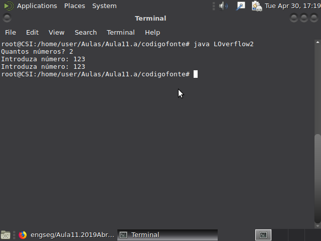
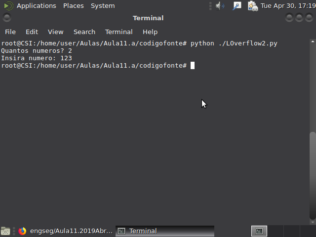
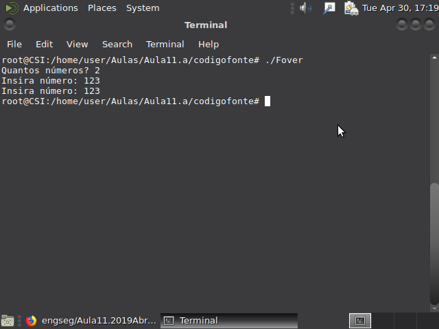
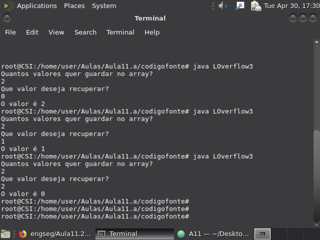
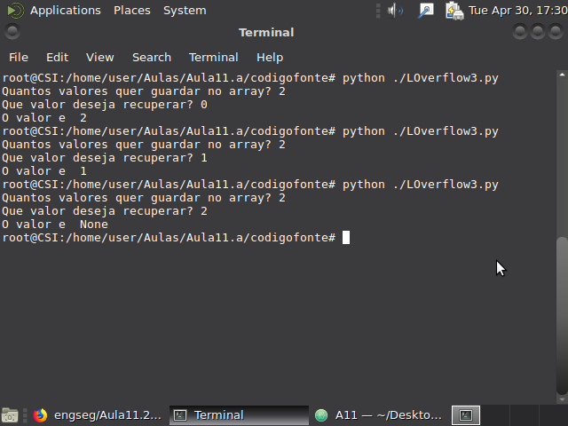
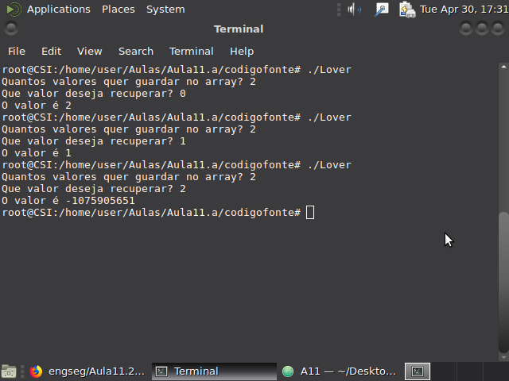
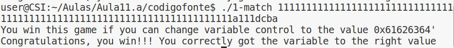

### 1. Buffer Overflow

#### P1.1

  Todos os programas tem como finalidade criar e preencher um array de tamanho arbitrario.
  No caso do programa em Java e C++, devido a maneira como a linguagem trabalha com arrays, o valor passado é
exatamente o número de valores que conseguimos colocar dentro do array, já em python o número de elementos que
conseguimos colocar dentro do array é menor do que o valor escolhido, pois é guardado 1 espaço para colocar o
valor que determina o fim do array, enquanto em java e c++ isto é feito de forma automatica.

#### P1.2

  Em todos os casos desde a posição 0 até o tamanho-1 todos funcionaram da mesma forma, no ultimo valor, ou seja,o valor do tamanho, cada um teve um comportamento diferente.
  O java devolveu o valor 0, pois a maneira como os arrays são compostos em java, estes terminam sempre com 0.
  O python devolveu "none" pois, naquela posição, nao existe nenhum número, apenas um valor que determina que o array termina ali.
  Já o c++ devolveu um número bastante grande, este valor provem de um espaço na memoria que esta junto ao array e que foi acedido quando tentamos ler algo que ja nao pertencia ao array, mas sim ao bloco de memoria o lado.

#### P1.3

 No primeiro caso, temos uma função que recebe uma password, se esta for diferente de "csi1" as permissões de root/admin são atributidas ao utilizador.
  Usando um ataque de bufferOverflow o atacante puderá ser capaz de conseguir ultrapassar esta verificação. Como o buffer não apresenta sistemas de segurança face a um buffer de tamanho maior que 4, o atacante, sabendo onde se encontra a posição exata da memoria onde esta a flag 1, consegue criar um buffer que escrever nesta posição o valor "1". Assim, mesmo que tenha colocado a palavra-pass errada, o utilizador consegue obter os privilegios.
  Esta segunda função é um teste a um ataque de BufferOverflow. Pois, nesta função há a criação de uma variavel "control" que, caso seja mudada para um valor diferente de 0, o utilizador ganha o "jogo"
  Para que tal seja possivel, é necessario, tal como em cima, que o utilizador conheca a posição da memoria da variavel "control" para conseguir, atraves de um buffer de tamanho maior que 64, modificar esse valor para qualquer número que deseja.
 

#### P1.4
Para começar, podemos ver que o programa **ReadOverflow** efetua o padding sob a forma de '.', no final da string, caso o número de caracteres dados seja maior que o comprimento da frase.
A leitura do numero de caracteres, por sua vez, é feita com o auxilio da função *fgets*, consideramos segura, e, para evitar injeção recorremos à função *iscntrl* no buf.
No entanto, como o buffer *buf* tem tamanho fixo, quando esse tamanho é ultrapassado, o programa apresenta um mau funcinamento.

#### P1.5

Primeiro analisando o código conseguimos perceber que o objetivo é colocar `0x61626364` na variável `control`.

Para tal, temos de ao preencher o buffer com a string sobrepor o valor da variável `control` com a string.
Como não é testado o tamanho da string depois de encontrarmos o tamanho necessário para chegar à variável `control`, que são de 77 carateres, só temos de agora colocar o valor `0x61626364` no final da string.
Assim sendo, o valor corresponde à string 'abcd', mas como estamos num sistema little-endian, o que queremos na realidade é o inverso, pois 'abcd' corresponde neste caso a `0x64636261`, e sendo assim temos de colocar a string 'dcba':

### 2. Vulnerabilidade de inteiros

#### P2.1

#### 1)

A vulnerabilidade da função está relacionada com o overflow/underflow de inteiros.
Isto deve-se ao facto, de na função `vulneravel` não se efetuar uma verificação dos valores de `x` e `y` que são utilizados para alocar o espaço referente à matriz, e como tal pode ter como efeitos não alocar o espaço pretendido para a matriz, o que irá fazer com o programa escreva em locais de memória que não foram alocados para a matriz e força o programa a parar.

#### 2)
Para demonstrar a vulnerabilidade, basta que o valor de `x*y` seja superior ao máximo valor permitido guardar num `size_t`:

#### 3)
Obtemos assim o seguinte erro:

E podemos observar também que o espaço alocado na realidade foi apenas para `1`, devido ao overflow.

#### P2.2

#### 1)
Como na questão anterior estamos perante uma vulnerabilidade de inteiros, neste caso um underflow, o que leva a que mais uma vez a memória não seja corretamente alocada.
Neste caso deve-se ao facto de a validação do tamanho que é passado como argumento à função vulnerável, não cobrir todos os casos. Apesar de testar um eventual overflow, não testa para o caso em que o tamanho é 0, e como tal, quando isso acontece o valor do `tamanho_real` será -1, o que torna impossível alocar a memória para a string, retornando assim um apontador nulo, o que causa erro em `memcpy`.

#### 2)
Para demonstrar a vulnerabilidade temos então de passar o tamanho com o valor 0:

#### 3)
Obtemos o erro:

E podemos constatar que o `tamanho_real` está a -1.
