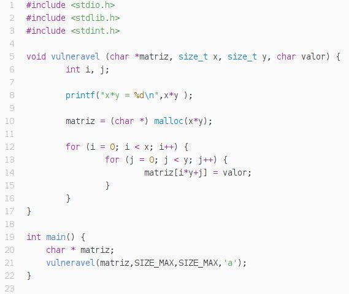
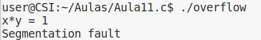
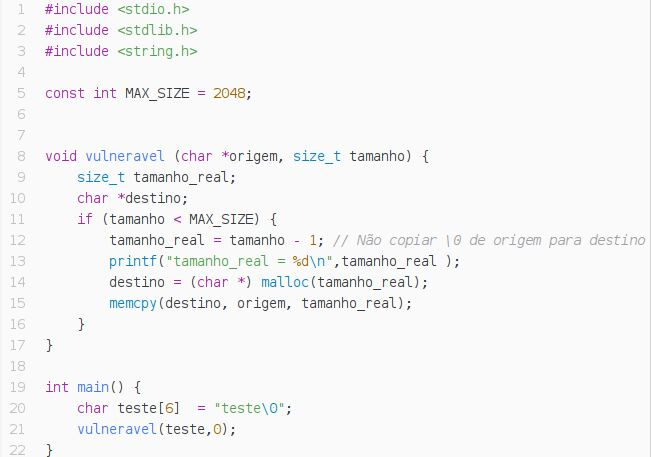
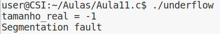

### 1. Buffer Overflow

#### P1.1

#### P1.2

#### P1.3

#### P1.4
Para começar, podemos ver que o programa **ReadOverflow** efetua o padding sob a forma de '.', no final da string, caso o número de caracteres dados seja maior que o comprimento da frase.
A leitura do numero de caracteres, por sua vez, é feita com o auxilio da função *fgets*, consideramos segura, e, para evitar injeção recorremos à função *iscntrl* no buf.
No entanto, como o buffer *buf* tem tamanho fixo, quando esse tamanho é ultrapassado, o programa apresenta um mau funcinamento.

#### P1.5

### 2. Vulnerabilidade de inteiros

#### P2.1

#### 1)

A vulnerabilidade da função está relacionada com o overflow/underflow de inteiros.
Isto deve-se ao facto, de na função `vulneravel` não se efetuar uma verificação dos valores de `x` e `y` que são utilizados para alocar o espaço referente à matriz, e como tal pode ter como efeitos não alocar o espaço pretendido para a matriz, o que irá fazer com o programa escreva em locais de memória que não foram alocados para a matriz e força o programa a parar.

#### 2)
Para demonstrar a vulnerabilidade, basta que o valor de `x*y` seja superior ao máximo valor permitido guardar num `size_t`:

#### 3)
Obtemos assim o seguinte erro:

E podemos observar também que o espaço alocado na realidade foi apenas para `1`, devido ao overflow.

#### P2.2

#### 1)
Como na questão anterior estamos perante uma vulnerabilidade de inteiros, neste caso um underflow, o que leva a que mais uma vez a memória não seja corretamente alocada.
Neste caso deve-se ao facto de a validação do tamanho que é passado como argumento à função vulnerável, não cobrir todos os casos. Apesar de testar um eventual overflow, não testa para o caso em que o tamanho é 0, e como tal, quando isso acontece o valor do `tamanho_real` será -1, o que torna impossível alocar a memória para a string, retornando assim um apontador nulo, o que causa erro em `memcpy`.

#### 2)
Para demonstrar a vulnerabilidade temos então de passar o tamanho com o valor 0:

#### 3)
Obtemos o erro:

E podemos constatar que o `tamanho_real` está a -1.