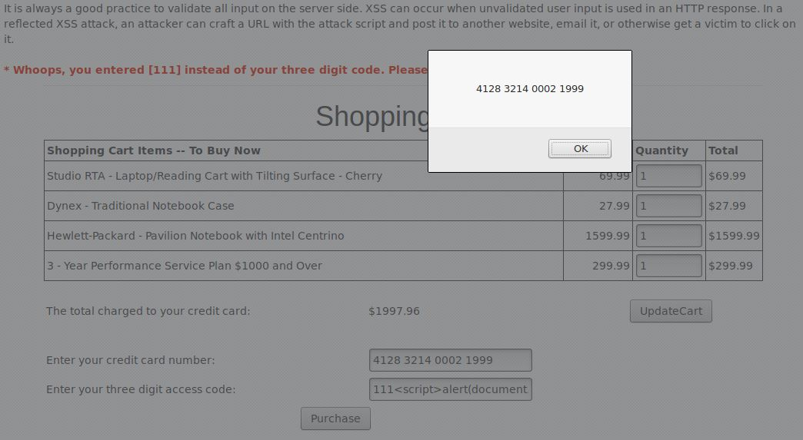

### 1.Injection

#### P1.1

#### 1)
Ao experimentar com diversos nomes, como "Snow" ou "youaretheweakestlink", aparecem os números de CC dos clientes, bem como o seu tipo, *cookies* e contagem de logins.

#### 2)
De modo a executar o ataque de *SQL Injection* e ver os dados de todos os clientes, fazemos que a equação seja sempre verdadeira, por exemplo, fazendo com que a comparação seja 

> **'or '1'='1**

#### P1.2

#### 1)
Ao selecionar um dos 4 estados, é apresentada a temperatura mínima e máxima desse estado, bem como o número da estação.

#### 2)
Neste exercício não é apresentado uma caixa de texto, como no anterior, mas sim uma seleção onde escolhemos uma de quatro opções, dificultando o uso da técnica usada no exercício 1.2, pelo menos sem o uso de ferramentas extra.

#### 3)
Como foi recomendado, usámos a ferramenta de *Developer* do explorador para conseguir ver o código que corre no exercício, sendo também capaz de o alterar.

#### 4)
Explorando o HTML apresentado, encontrando a lista de opções possiveis, temos apenas que acrescentar aquela que apresentará todos os valores: 
> `<option value="''OR TRUE">Todas</option>`

 e vemos os dados, não só das quatro opções que apresentavam antes, bem como de duas novas estações
|STATION |	NAME |	STATE |	MIN_TEMP |	MAX_TEMP |
|:------:|:------:|:------:|:------:|:------:|
| 101	| Columbia	| MD	| -10	| 102 |
| 102	| Seattle	| WA	| -15	| 90 |
| 103	| New York	| NY	| -10	| 110 |
| 104	| Houston	| TX	| 20	| 120 |
| 10001	| Camp David	| MD	| -10	| 100 |
| 11001	| Ice Station Zebra	| NA	| -60	| 30 |

#### P1.3

#### 1)
Nesta fase temos que implementar uma segunda execução de *SQL*, de modo a aumentar o salário. Para isso, basta acrescentar à caixa de texto 

> 101 ]; update employee set salary=9999999 where userid = 101

fazendo assim com que o nosso salário seja atualizado para 9999999.

#### 2)
Agora basta acrescentar o *trigger* dado que o salário será atualizado:

> 101];CREATE TRIGGER myBackDoor BEFORE INSERT ON employee FOR EACH ROW BEGIN UPDATE employee SET email='john@hackme.com'WHERE userid = NEW.userid

### 2. XSS

#### P2.1

Primeiro começamos por encontrar o campo vulnerável, que neste caso é o campo do código de acesso, que podemos observar através do script ** :

e sendo assim, podemos agora obter outros campos que o utilizador preencheu, como por exemplo o número de cartão de crédito, modificando o script anterior para obter o valor do campo *field2*:

### 3. Quebra na Autenticação

#### P3

Nesta questão o nosso objectivo era entender como funcionam os mecanismos de recuperação de palavras-passe.
Começamos com um teste onde era conhecido o utilizador que queríamos atacar e a resposta à pergunta de segurança que seria necessária para recuperar a palavra-passe. O utilizador era "WebGoat", e a pergunta que nos foi feita foi "qual é a sua cor favorita?", mas como já sabia que a resposta era "red" este processo foi bastante fácil.
Após isto foi nos proposto encontrar um utilizador que fosse interessante para este ataque. No nosso caso, foi escolhido o utilizador "admin". Com isto era necessário responder à mesma pergunta feita em cima, mas desta vez não se sabia, do começo, qual era a resposta. Então, decidimos usar "brute-force", para tentar recuperar a palavra-passe. Este processo foi bastante rápido, pois apenas precisamos de 3 tentativas: "red", "blue" e "green". E visto que a resposta certa era Green, conseguimos obter a palavra-passe do utilizador admin.

