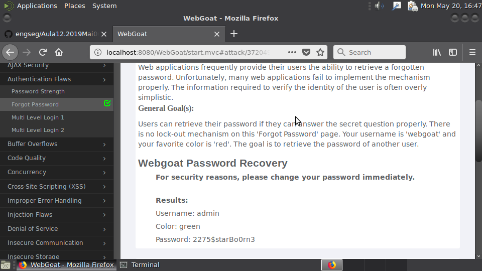

### TP12

#### P3

Nesta questão o nosso objectivo era entender como funcionam os mecanismo de recuperação de palavra-pass.
Inicialmente começamos com um teste onde, era conhecido o utilizador que queriamos atacar e a resposta á pergunta
de segurança que seria necessaria para recuperar a palavra-pass. O utilizador era "WebGoat" e a pergunta que nos foi
feita foi "qual é a sua cor favorita?", mas como ja sabia que a resposta era "red" este processo foi bastante facil.
Após isto foi nos proposto encontrar um utilizador que fosse interessante para este ataque. No nosso caso, foi escolhido
o utilizador "admin". Com isto era necessario responder a mesma pergunta feita em cima, mas desta vez nao se sabia, do começo,
qual era a resposta. Entao, nos decidimos usar "brute-force", para tentar recuperar a palavra-pass. Este processo foi
bastante rapido, pois apenas precisamos de 3 tentativas: "red", "blue" e "green". E visto que a resposta certa era Green,
conseguimos obter a palavra-pass do utilizador admin.
(de relembras que nao foi usado nenhum "show hint" ou nenhum "show solution").

