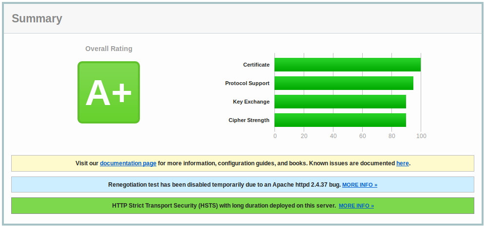
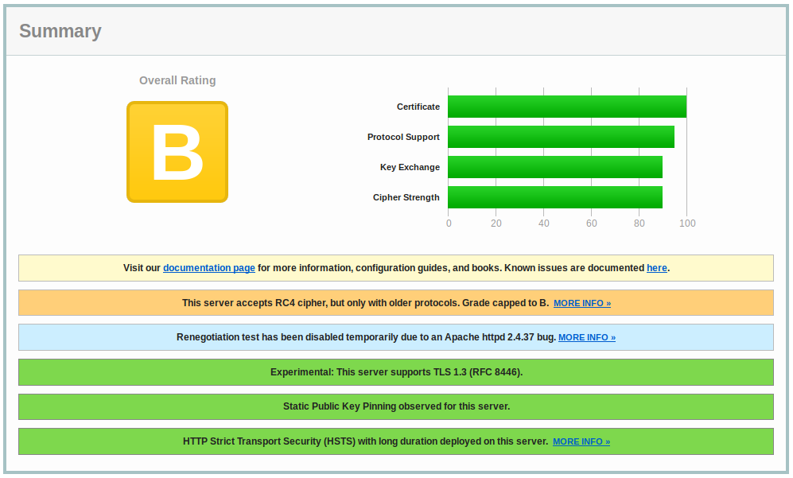
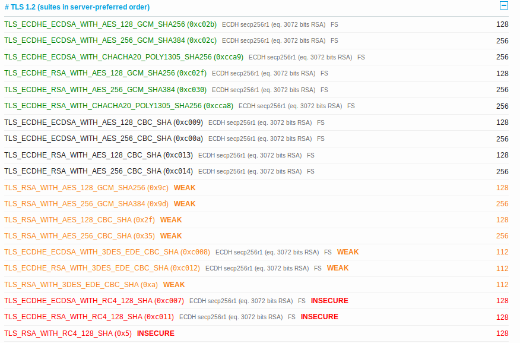

#### P2.1 i)Anexe os resultados do _SSL Server test_ à sua resposta
Como pedido, escolhemos três sites de empresas cotadas no ***NASDAQ***, empresas essas:
- [Microsoft Corporation](www.microsoft.com)
	- [SSL](https://www.ssllabs.com/ssltest/analyze.html?d=www.microsoft.com&latest)
	- [HTML](./SSL-Results/Microsoft.html)
- [Apple Inc.](www.apple.com)
	- [SSL](https://www.ssllabs.com/ssltest/analyze.html?d=www.apple.com&latest)
	- [HTML](./SSL-Results/Apple.html)
- [Facebook](https://www.facebook.com)
	- [SSL](https://www.ssllabs.com/ssltest/analyze.html?d=www.facebook.com)
	- [HTML](./SSL-Results/Facebook.html)

Em primeiro lugar é importante de notar que ambas as três empresas apresentam mais que um server capaz de transmitir o site à altura dos testes feitos, apresentando todos a mesma classificação. Como tal, avaliaremos apenas um dos servidores de cada empresa.
Como podemos ver, o site da *[Microsoft](microsoft.com)*
 e da *[Apple](apple.com)* apresentam, respetivamente, A+ e A na classificação dada pelo *SSL*.

Já o site do *[Facebook](facebook.com)* apresenta uma classificação de B:

#### P2.1 ii) Analise o resultado do _SSL Server test_ relativo ao site escolhido com pior rating. Que comentários pode fazer sobre a sua segurança. Porquê?
Como vimos, o pior valor atribuido foi ao site da rede social. Não só o site aceita cifras [RC4](https://blog.qualys.com/ssllabs/2013/03/19/rc4-in-tls-is-broken-now-what?_ga=2.16122420.326019711.1550941154-115483375.1550941154), mesmo que seja só com protocolos antigos, como vemos na imagem anterior, como também, numa exploração mais aprofundada da analise feita pelo *[SSL](./SSL-Results/Facebook.html)*, vemos que o site aceita diversas *Cipher Suites* nao recomendadas no TLS 1.2, de entre elas três inseguras e sete muito fracas.

Comparando o tamanho das chaves aqui apresentadas e a lista do NIST, vemos que muitas destas chaves deveriam apresentar um tamanho bastante superior para assegurar melhor a sua segurança, bem como deixar de suportar as três cifras inseguras.

Mesmo com as notas positivas apresentadas no [resumo inicial](./SSL-Results/Facebook.png),como o suporte a TLS 1.3, *[Static Public Key Pinning](https://scholarworks.iu.edu/dspace/bitstream/handle/2022/21039/PKI-ASAF-design-docs.pdf?sequence=4)* e *[HTTP Strict Transport Security](https://en.wikipedia.org/wiki/HTTP_Strict_Transport_Security)* (HSTS) com longa duração, estas medidas baixam a avaliação para B.

#### P2.1 iii) É natural que tenha reparado na seguinte informação: "_OpenSSL Padding Oracle vuln. (CVE-2016-2107)_" na secção de detalhe do protocolo. O que significa, para efeitos práticos?
Para analisar o *CVE* podemos, como foi pratica no semestre passado, começar por analisar o mesmo no *[MITRE](https://cve.mitre.org/index.html)* e na *[National Vulnerability Database](https://nvd.nist.gov/)*(NVD), onde vemos que a implementação AES-NI no OpenSSL antes da versão 1.0.1t e 1.0.2 antes de 1.0.2h não considera alocação de memória durante certas verificações de *padding*, o que permite a atacantes obter acesso a informação limpa sensível via um ataque *padding-oracle* à sessão AES CBC.
Pela [NVD](https://nvd.nist.gov/vuln/detail/CVE-2016-2107) vemos que a esta vulnerabilidade foi atribuida a avaçiação de 5.9, correspondente a um risco Médio, e uma série de soluções e ferramentas que podem resolver esta vulnerabilidade.
No entanto, a própria análise feita pelo *SSL* apresenta um [link](https://blog.cloudflare.com/yet-another-padding-oracle-in-openssl-cbc-ciphersuites/) sobre este problema, explicando o que se passa e apresentando uma solução para o mesmo, de forma mais fácil de entender que as fontes anteriores.
Em suma, as cifras *CBC* no *TLS* apresentam uma falha: calculam o *HMAC* do texto limpo e só depois cifram `plaintext || HMAC || padding || padding length` com CBC, fazendo com que o recebedor tênha que decifrar a mensagem e comparar o *HMAC* sem nunca dar a conhecer a um atacante o tamanho do *padding*. Se o fizer, um atacante consegue aprender o ultimo byte de cada bloco e, por iteração, a mensagem inteira. Chamamos a isso um **padding oracle**.
[Texto a ser cifrado pelo CBC](./diagrama.png)
Como solução, propõem escrever o *HMAC* e calcular o codigo que verifica o *padding* em tempo perfeitamente constante. A ideia é guardar a comparação de cada bit da verificação com 1. Se algum dos resultados dor 0 , o resultado é 0, senão é 1. Assim, um atacante apenas consegue saber se tudo, incluindo o *HMAC* e o *padding*, está bem ou mal.