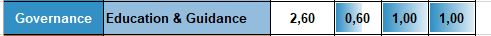
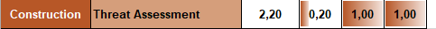
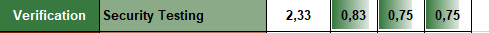

### 1. Risco

#### P1.1
Relembrando a formula de risco:

    risco = probabilidade de ataque ter sucesso * impacto

em que

    probabilidade do ataque ter sucesso = nível da ameaça * grau de vulnerabilidade

Enquanto que o impacto de um servidor de _homebanking_ de um Banco é superior ao de um PC doméstico, no que toca à probabilidade de um ataque ter sucesso mostra-se equiparável ao segundo já que apresenta um nível de ameaça bem mais alto, porém supomos também que apresenta um grau de vulnerabilidade bastante inferior, já que apresenta diversos especialistas a assegurar a segurança do sistema, ao contrário do PC doméstico, fácil de atacar.

Assim, é facil ver que o risco de um servidor de _homebanking_ de um Banco está sujeito a um risco em muito superior a um PC doméstico.

### 2. Secure Software Development Lifecycle (S-SDLC)

#### P2.1
Num modelo _Microsoft Security Development Lifecycle_ o regulamento europeu RGPD deve ser consultado na fase de requisitos, mas acima de tudo na fase de Desenho(_**Design**_). já que é aí que se desenha a arquitetura do software de acordo com princípios e regras estabelecidos como seguros, e se analisa o risco do desenho da arquitetura do software.

#### P2.3
Ao consultar a secção 2.3(_Key Roles and Responsabilities in the SDLC_) vemos a existência de uma grande variedade de posições e trabalhos diferentes que cada membro de um grupo deve acarretar. No entanto, até aos trabalhos mais recentes, os elementos dos grupos de trabalho tiveram todos uma posição de _Software Developer_ acima de todas as outras tarefas e responsabilidades, havendo, por ventura, um _System Architect_ ou um _Program Manager_, o que poderá ter levado a diversos problemas, evitáveis se seguíssemos o sistema sugerido.

### 3. SAMM (Software Assurance Maturity Model)

#### P3.1
Como pedido, escolhemos 3 práticas de segurança que utilizamos no desenvolvimento do projeto da UC de Engenharia de Segurança:

 - 
 - 
 - 

Como vemos nas imagens, obtemos um valor bastante positívo no valor da maturidade das três práticas.
#### P3.2
Apesar dos bons resultados, a maturidade das 3 práticas pode ser aumentada, sendo por isso o objetivo aumentar os dois primeiros para um valor superior a 2,5 e, se posssivel, aumentar a maturidade da **Education & Guidance**, que é grande parte do projeto, para um valor perto de 3 ou mesmo 3.

#### P3.3
Graças ao SAMM facilmente estabelecemos um plano para quatro fazes, de modo a aumentar a maturidade das práticas discutidas anteriormente:

- [Education & Guidance](Imagens/EG1.PNG)
- [Education & Guidance](Imagens/EG2.PNG)
 - [Threat Assessment](Imagens/TA1.PNG)
 - [Threat Assessment](Imagens/TA2.PNG)
 - [Security Testing](Imagens/ST1.PNG)
 - [Security Testing](Imagens/ST2.PNG)